# docker基础

- [docker概述](#docker概述)
    - [docker的出现？](#docker的出现？)
    - [docker解决思想](#docker解决思想)
    - [docker历史](#docker历史)
    - [docker链接](#docker链接)
    - [docker能干什么？](#docker能干什么？)
    - [开发-运维](#开发-运维)
- [docker安装](#docker安装)
    - [镜像(image)](#镜像(image))
    - [容器(container)](#容器(container))
    - [仓库(repository)](#仓库(repository))
    - [底层原理](#底层原理)
- [docker命令](#docker命令)
    - [帮助命令](#帮助命令)
    - [镜像命令](#镜像命令)
        - [docker-images查看所有本地主机上的镜像](#docker-images查看所有本地主机上的镜像)
        - [docker-search搜索镜像](#docker-search搜索镜像)
        - [docker-pull下载镜像](#docker-pull下载镜像)
        - [docker-remove删除镜像](#docker-remove删除镜像)
    - [容器命令](#容器命令)
        - [docker-run新建容器并启动](#docker-run新建容器并启动)
        - [docker-ps列出运行容器](#docker-ps列出运行容器)
        - [退出容器](#退出容器)
        - [docker-rm删除容器](#docker-rm删除容器)
        - [启动和停止容器的操作](#启动和停止容器的操作)
    - [操作命令](#操作命令)
        - [后台启动容器](#后台启动容器)
        - [查看日志](#查看日志)
        - [查看容器中进程信息](#查看容器中进程信息)
        - [查看镜像元数据](#查看镜像元数据)
        - [进入当前正在进行的容器](#进入当前正在进行的容器)
        - [从容器拷贝文件到主机上](#从容器拷贝文件到主机上)
    - [打包操作](#打包操作)
        - [加载包](#加载包)
        - [修改包](#修改包)
        - [保存包](#保存包)
- [命令实战](#命令实战)
    - [安装nginx](#安装nginx)
    - [安装tomcat](#安装tomcat)
    - [部署es+kibana](#部署es+kibana)
- [docker镜像](#docker镜像)
    - [镜像是什么？](#镜像是什么？)
    - [docker镜像加载原理](#docker镜像加载原理)
        - [UnionFS(联合文件系统)](#UnionFS(联合文件系统))
        - [加载原理](#加载原理)
    - [分层理解](#分层理解)
    - [commit镜像](#commit镜像)
- [容器数据卷](#容器数据卷)
    - [docker的理念回顾](#docker的理念回顾)
    - [使用数据卷](#使用数据卷)
    - [实战](#实战)
    - [具名和匿名挂载](#具名和匿名挂载)
        - [多个mysql共享数据](#多个mysql共享数据)
- [dockerfile](#dockerfile)
    - [DockerFile介绍](#DockerFile介绍)
    - [DockerFile构建过程](#DockerFile构建过程)
    - [DockerFile指令](#DockerFile指令)
    - [实战测试](#实战测试)
    - [发布自己的镜像](#发布自己的镜像)
    - [实战](#发布自己的镜像)
- [小结](#小结)
- [docker网络原理](#docker网络原理)
    - [理解docker](#理解docker)
    - [--link](#--link)
    - [自定义网络](#自定义网络)
    - [网络连通](#网络连通)
- [IDEA整合docker](#IDEA整合docker)
- [docker-compose](#docker-compose)
- [docker-swarm](#docker-swarm)
- [CI/CD-jenkins](#CI/CD-jenkins)

------

## docker概述

### docker的出现？

> 一款产品：开发---上线 两套环境！应用环境，应用配置！
>
> 开发---运维。问题：我在我的电脑上看可以运行！版本更新，导致服务不可用！对于运维来说，考验就十分大？
>
> 环境配置是十分麻烦，每一个机器都要部署环境（集群redis，ES，Hadoop....）!费时费力。
>
> 发布一个项目（jar+（redis mysql， jdk， Es）项目能不能带上环境安装打包！
>
> 之前在服务器配置一个应用环境redis、msyql、jdk、es、hadoop，配置超麻烦，不能够跨平台。
>
> window/Mac 最后发布到linux！
>
> 传统：开发，运维来做！
>
> 现在：开发打包部署上线，一套流程做完！
>

### docker解决思想

> 隔离：docker核心思想打包装箱！每个箱子是相互独立的
>

### docker历史

> 2010年，几个搞IT的年轻人，就在美国成立了一家公司dotCloud
>
> 做一些pass的云计算服务！LXC有关的容器技术
>
> 他们将自己的技术（容器化技术）命名就是docker！
>
> docker刚刚诞生的时候，没有引起行业的注意！dotCloud，就活不下去！
>
> 开源：开发源代码！
>
> 2013年，docker开源！
>
> 越来越多的人发现了docker的优点！火了，docker每个月都会更新一个版本！
>
> 2014年4月9日，docker1.0发布！
>
> docker为啥这么火？十分的轻巧
>
> 在容器技术出来之前，我们都是使用虚拟机技术！
>
> 虚拟机：在window中装一个Vmware，通过这个软件我们可以虚拟出来一台或者多台电脑！笨重！
>
> 虚拟机也是虚拟化技术，docker容器技术，也是一种虚拟化技术！
>

```shell
vm: linux centos原生镜像（一个电脑），隔离需要开启多个虚拟几！ 几个G 几分钟
docker，隔离镜像（最核心的环境4M + jdk + mysql）十分的小巧，运行镜像就可以了！ 几个M KB秒级启动
```

### docker链接

[官网](https://www.docker.com)

[文档](https://docs.docker.com)

[仓库](https://hub.docker.com)

### docker能干什么？

虚拟机技术缺点：

1. 资源占用十分多
2. 冗余步骤多
3. 启动很慢

容器化技术：

容器化技术不是模拟的一个完整的操作系统

比较docker和虚拟机的不同：

- 传统虚拟机，虚拟出一条硬件，运行一个完整的操作系统，然后在这个系统上安装和运行软件
- 容器内的应用直接在宿主机的内容，容器是没有自己的内核的，也没有虚拟我们的硬件，所以就轻便了
- 每个容器间是相互隔离的，每个容器都有一个属于自己的文件系统，互不影响。

### 开发-运维

- 应用更快的交付和部署

  传统：一堆帮助文档，安装程序

  docker：打包镜像发布测试，一键运行

- 更便捷的升级和扩缩容

  使用了docker之后，我们部署应用酒喝搭积木一样！

  项目打包为一个镜像，扩展服务器A！服务器B

- 更简单的系统运维

  在容器化之后，我们的开发，测试环境都是高度一致的

- 更高效的计算资源利用

  docker是内核级别的虚拟化，可以在一个物理机上运行很多的容器实例！服务器的性能可以压榨到极致

## docker安装

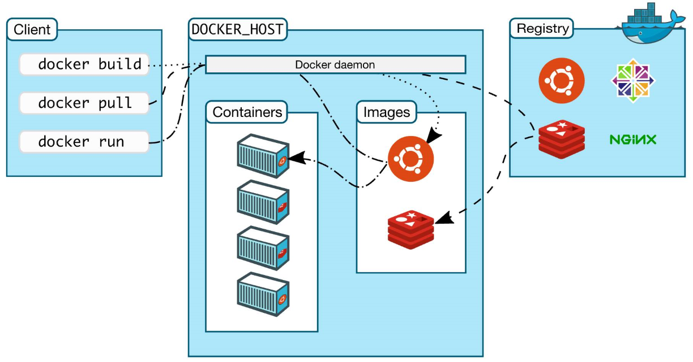

### 镜像(image)

docker镜像就好比是一个模版，可以通过这个模版来创建容器服务，例如tomcat镜像===>run===>tomcat01容器（提供服务器），通过这个惊喜那个可以创建多个容器（最终服务运行或者项目运行就是在容器中的）。

### 容器(container)

docker利用容器技术，独立运行一个或者一组应用，通过镜像来创建的。

启动、停止、删除、基本命令

目前就可以把这个容器理解为一个建议的linux系统

### 仓库(repository)

仓库就是存放镜像的地方！

仓库分为公有仓库和私有仓库！

docker hub（默认是国外的）

[安装文档](https://docs.docker.com)

### 底层原理

**docker是怎么工作的？**

docker是一个c-s结构的系统，docker的守护进程运行在主机上，通过socket从客户端访问！

docker-server接收到docker-client的命令，就回去执行这个命令！

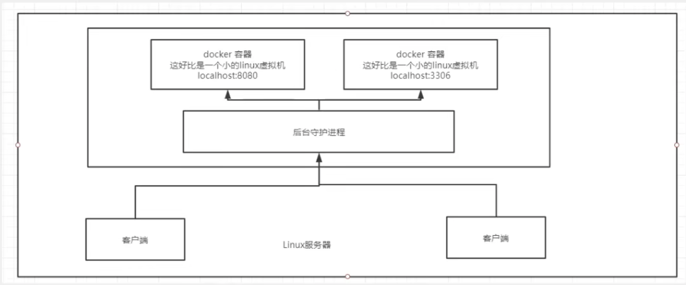

**docker为什么比vm快？**

1. docker有着比虚拟机更少的抽象层
2. docker利用的是宿主机的内核，vm需要的是guest os

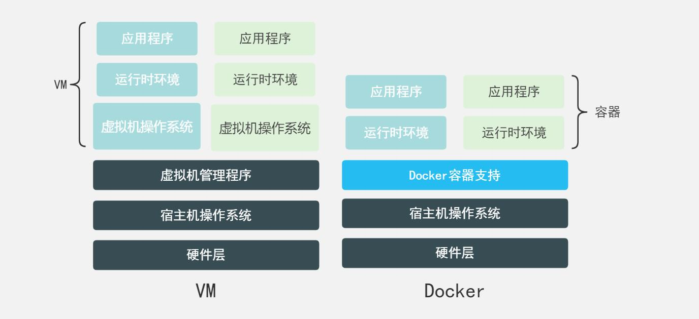

所以说，新建一个容器的时候，docker不需要想虚拟机一样重新加载一个操作系统内核，避免引导。虚拟机是加载GuestOS，分种级别，而docker是利用宿主机的操作系统，省略了这个复杂，秒级！

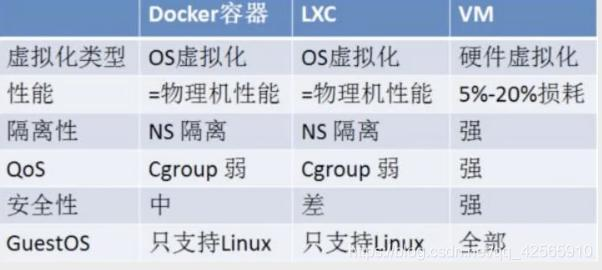

## docker命令

### 帮助命令

```shell
docker version # 查看版本信息
docker info # 查看系统信息
docker 命令 --help # 万能命令
```

### 镜像命令

#### docker-images查看所有本地主机上的镜像

```shell
dongqizhengdeMacBook-Pro:~ zhengdongqi$ docker images
REPOSITORY    TAG       IMAGE ID       CREATED        SIZE
hello-world   latest    d1165f221234   5 months ago   13.3kB

# 解释
REPOSITORY 	# 镜像的仓库源
TAG 				# 镜像的标签
IMAGE ID 		# 镜像的ID
CREATED 		# 镜像的创建时间
SIZE 				# 镜像的大小

# 可选项
-a, --all 	# 列出所有的镜像
-q, --quiet	# 只显示镜像的ID	
```

#### docker-search搜索镜像

```shell
dongqizhengdeMacBook-Pro:~ zhengdongqi$ docker search mysql
NAME                              DESCRIPTION                                     STARS     OFFICIAL   AUTOMATED
mysql                             MySQL is a widely used, open-source relation…   11273     [OK]
mariadb                           MariaDB Server is a high performing open sou…   4279      [OK]

# 可选项， 通过搜索来过滤
--filter=STARS=3000 # 搜索出来的镜像就是STARS大于3000的
```

#### docker-pull下载镜像

```shell
docker pull mysql:1.0
```

#### docker-remove删除镜像

```shell
docker rmi -f 容器ID # 删除一个容器
docker rmi -f 容器ID 容器ID # 删除多个容器
docker rmi -f $(docker images -aq) # 删除多个容器，一个一个递归删除
```

### 容器命令

说明：我们有了镜像才可以创建容器，linux，下载一个centos镜像来测试学习

```shell
docker pull centos
```

#### docker-run新建容器并启动

```shell
docker run [可选参数] image

# 参数说明
--name="Name" # 容器名字，用来区分容器
-d # 后台方式运行
-it # 使用交互式方式运行，进入容器查看内容
-p # 指定容器的端口
	-p # ip：主机端口：容器端口
	-p # 主机端口：容器端口（常用）
	-p # 容器端口
-P # 随机指定端口

docker run -it centos /bin/bash # 进入容器
```

#### docker-ps列出运行容器

```shell
docker ps # 列出当前正在运行容器
-a # 列出当前正在运行运行的容器+历史运行过的容器
-n=? # 显示最近创建的容器
-q # 只显示容器的编号
```

#### 退出容器

```shell
exit # 直接容器停止并退出容器
Ctrl + P + Q # 容器不停止退出
```

#### docker-rm删除容器

```shell
docker rm 容器ID # 删除指定的容器，不能删除正在运行的容器
docker rm -f $(docker ps -aq) # 删除所有的容器
docker ps -a -q | xargs docker rm # 删除所有的容器
```

#### 启动和停止容器的操作

```shell
docker start 容器ID # 启动容器
docker restart 容器ID # 重启容器
docker stop 容器ID # 停止当前正在运行的容器
docker kill 容器ID # 强制停止当前容器
```

### 操作命令

#### 后台启动容器

```shell
docker run -d 镜像名！
docker run -d centos

# 问题docker ps 发现centos停止了
# 常见的坑，docker容器使用后台运行，就必须要有一个前台进程，docker发现没有应用，就会自动停止
# nginx 容器启动后，发现自己没有提供服务，就会立刻停止，就是没有程序了
```

#### 查看日志

```shell
docker logs -f -t --tail 容器
docker logs -tf --tail 10 容器ID
```

#### 查看容器中进程信息

```shell
docker top 容器ID
```

#### 查看镜像元数据

```shell
docker inspect 容器ID
```

#### 进入当前正在进行的容器

```shell
# 方式1
docker exec -it 容器ID shell方式
# 方式2
docker attach 容器ID
# 区别
docker exec # 进入容器后开启一个新的终端，就可以在里面操作（常用）
docker attach # 进入容器正在执行的终端，不会启动新的进程
```

#### 从容器拷贝文件到主机上

```shell
docker cp 容器ID：容器内路径 目的主机路径
# docker cp 容器ID:/home/test /home
```

### 打包操作

#### 加载包

```bash
# docker load -i ***.tar
docker load -i image.tar

# 查看
docker images
```

#### 修改包

```bash
# docker run -it --name *** image
docker run -it --name tmp {image_id}
# 如果docker封装了--entrypoint
docker run -ti --name tmp --entrypoint=“/bin/bash” {image_id}
# 修改完成后
exit

# 查看
docker ps -a
CONTAINER ID  IMAGE        COMMAND      CREATED      STATUS                 PORTS   NAMES
160ed9d4c04a  9ce83d5f015b "/bin/bash"  2 hours ago  Exited (0) 2 hours ago         transcode_git
```

#### 保存包

```bash
# commit
docker docker commit -a "zhengdongqi"   -m "update git lfs" {container_id}    transcode_image:1.1
# 如果docker封装了--entrypoint 需要去还原
docker docker commit -a "zhengdongqi"   -m "update git lfs" -change='ENTRYPOINT ["/bin/bash", "/launch.sh"]' {container_id}    transcode_image:1.1
# save
docker save -o transcode.tar transcode_image:1.1
```

## 命令实战

#### 安装nginx

```shell
# 1.搜索镜像 docker search
# 2.下载镜像 docker pull
# 3.运行测试 
docker run -d --name nginx01 -p 3344:80 nginx
docker ps
curl localhost:3344
# 4.进入容器 docker exec -it nginx01 /bin/bash
```

#### 安装tomcat

```shell
# 官方
docker run -it --rm tomcat:9.0
# 下载再启动
docker pull tomcat
# 启动运行
docker run -d -p 3355:8080 --name tomcat01 tomcat
# 测试
# 进入容器
docker exec -it tomcat01 /bin/bash
# linux命令少了，没有webapps
```

#### 部署es+kibana

```shell
# es 暴露的端口很多
# es 十分的耗内存
# es 的数据一般需要防止到安全目录！挂载
# --net somenetwork ? 网络配置

# 启动 elasticsearch
docker run -d --name elasticsearch -p 9200:9200 -p 9300:9300 -e "discovery.type=single-node" elasticsearch:7.6.2

# docker stats
# 限制内存
docker run -d --name elasticsearch -p 9200:9200 -p 9300:9300 -e "discovery.type=single-node" -e  ES_JAVA_OPTS="-Xms64m -Xmx512m" elasticsearch:7.6.2
```

## docker镜像

### 镜像是什么？

镜像是一种轻量级，可执行的独立软件包，用来打包软件运行环境和机遇运行环境开发的软件，它包含运行某个软件所需的所有内容，包括代码，运行时，库，环境变量和配置文件

所有的应用，直接打包docker镜像，就可以直接跑起来

**如何得到镜像？**

- 从远程仓库下载
- 朋友拷贝给你
- 自己制作一个镜像DockerFile

### docker镜像加载原理

#### UnionFS(联合文件系统)

UnionFS（联合文件系统）是一种分层、轻量级并且高性能的文件系统，它支持对文件系统的修改作为一次提交来一层层的叠加，通过你会死可以将不同目录挂载到同一虚拟文件系统下（unite several diretories into a single virtual filesystem），Union文件系统是docker镜像的基础，镜像可以通过分层来进行继承，给予基础镜像（没有父镜像），可以制作各种具体的应用镜像

**特性**：一次同时加载多个文件系统，但从外面看起来，只能看到一个文件系统，联合加载会把隔层文件系统叠加起来，这样最终的文件系统会抱憾所有底层的文件和目录。

#### 加载原理

docker的镜像实际上由一层一层的文件系统组成，这种层级的文件系统UnionFS。

bootfs（boot file system）主要包含bootloader和kernel，bootloader主要引导加载kernel，linux刚启动时会加载bootfs文件系统，在docker镜像的最底层时bootfs，这一层与我们典型的linux/Unix系统是一样的，包含boot加载起和内核。当boot加载完成之后整个哪壶酒都早内存中了，此时内存的使用权已由bootfs转交给内核，此时系统也会卸载bootfs。

rootfs（root file system），在bootfs之上，包含的就是典型linux系统中的dev/，/proc，/bin，/etc等标准目录和文件，rootfs就是各种不同的草足哦系统发行版，比如ubuntu，centos等等。

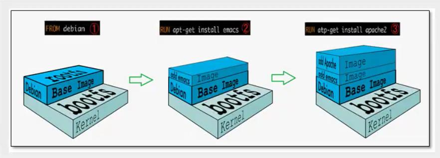

**平时我们安装虚拟机的centos都是好几个G，为什么docker这里才200M？**

对于一个精简的OS，rootfs可以很小，只需要包含最基本的命令、工具和程序库就可以了，因为底层直接用host的kernel，自己只需要提供rootfs就可以了，由此可见对于不同的linux发行版，bootfs基本是一致的，rootfs会有差别，因此不同的发行版可以公用bootfs

### 分层理解

在下载一个镜像的时候，可以观察的到日志是一层一层的下载


所有的docker镜像都起始于一个基础镜像层，当进行修改或增加新的内容时，就会在当前镜像层之上，创建新的镜像层。

**特点**

docker镜像都是只读的，当容器启动时，一个新的可写层被加载到镜像的顶部！

这一层就是我们通常说的容器层，容器之下的都叫镜像层

### commit镜像

```shell
docker commit # 提交容器成为一个新的镜像

# 命令和git原理类似 
docker -m=“提交的描述信息” -a=“作者” 容器ID 目标镜像名，【TAG】
```

实战测试

```shell
# 1.启动一个默认的tomcat
# 2.发现这个默认的tomcat是没有webapps应用，镜像的原因。官方镜像默认webapps下面是没有文件的！
# 3.我自己拷贝进去了基本的文件
# 4.将我们操作过的容器通过commit调剂
```

## 容器数据卷

### docker的理念回顾

将应用和环境打包成一个镜像！

数据？如果数据都在容器中，那么我们容器删除，数据就会丢失！需求：数据持久化

mysql，容器删了，删库跑路！需求：mysql数据可以存储在本地！

容器之间可以有一个数据共享的技术！docker容器中产生的数据，同步到本地！

这就是卷技术！目录的挂载，将我们容器内的目录，挂载到Linux上面！

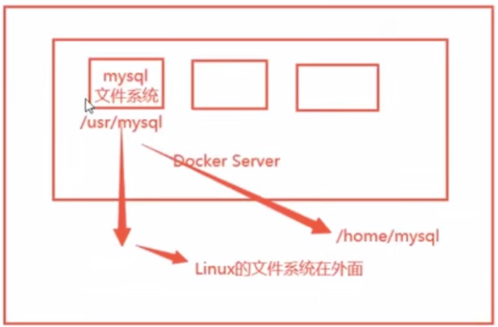

### 使用数据卷

- 方式1

  ```shell
  docker run -it -v 主机目录：容器内目录
  
  # 测试
  docker run it -v /home/ceshi:/home centos /bin/bash
  # 启动起来时我们可以通过docker inspect 容器ID 来查看一下挂载是否正常
  ```

### 实战

安装mysql

思考，mysql持久化的问题！

```shell
# 获取镜像
docker pull mysql:5.7

# 运行容器，需要做数据挂载，
# 安装启动mysql，需要配置密码，这也是注意点！
# 官方测试
docker run --name some-mysql -e MYSQL_ROOT_PASSWORD=my-secret-pw -d mysql:tag
# 启动我们的
-d # 后台运行
-p # 端口映射
-v # 卷挂载
-e # 环境配置
--name

docker run -d -p 3310:3306 -v /home/mysql/conf:/etc/mysql/conf.d -v /home/mysql/data:/var/lib/mysql -e MYSQL_ROOT_PASSWORD=123456 --name mysql01 mysql:5.7

# 启动成功之后，我们在本地使用sqlyog测试一下
```

### 具名和匿名挂载

```shell
# 匿名挂载
-v 容器内路径！
docker run -d -p --name nginx01 -v /etc/nginx nginx

# 查看挂载的情况
docker volume ls
# 这里发现，这种就是匿名挂载，我们在 -v 只写了容器内的路径，没有写容器外的路径

# 具名挂载
docker run -d -P --name nginx02 -v juming-nginx:/etc/nginx nginx

docker volume ls
# 看到命名为 juming-nginx

# 通过 -v 卷名：容器内路径
# 查看一下这个卷
docker volume inspect juming-nginx

# 所有的docker容器内的卷，没有指定目录的情况下都是在 /var/lib/docker/volumes/xxxx
```

我们通过具名挂载可以方便的找到我们的一个卷，大多数情况在使用的具名挂载

```shell
# 如何确定是具名挂载还是匿名挂载，还是指定路径挂载！
-v 容器内路径	# 匿名挂载
-v 卷名:容器内路径	# 具名挂载
-v /宿主机路径:容器内路径 	# 指定路径挂载
```

拓展

```shell
# 通过 -v 容器内路径，ro、rw 改变读写权限
ro readonly # 只读
rw readwrite # 可读可写

docker run -d -P --name nginx02 -v juming-nginx:/etc/nginx:ro nginx
docker run -d -P --name nginx02 -v juming-nginx:/etc/nginx:rw nginx
```

#### 多个mysql共享数据

```shell
docker run -d -p 3310:3306 -v /etc/mysql/conf.d -v /var/lib/mysql -e MYSQL_ROOT_PASSWORD=123456 --name mysql01 mysql:5.7

docker run -d -p 3310:3306 -v /etc/mysql/conf.d -v /var/lib/mysql -e MYSQL_ROOT_PASSWORD=123456 --name mysql02 --volume-from mysql01 mysql:5.7

# 这个时候，可以实现两个容器数据同步
```

## dockerfile

### DockerFile介绍

DockerFile就是用来构建docker镜像的构建文件！命令脚本！先体检一下！

通过这个脚本可以生成镜像，镜像是一层一层的，脚本的一个个命令，每个命令都是一层！

```shell
# 创建一个dockerfile
# 文件中的指令。大写
FROM centos
VOLUME ["volume01", "volume02"] # 匿名挂载

CMD echo "----end----"
CMD /bin/bash

# 这里的每个命令，就是镜像的一层
```

**基础知识**

1. 每个保留关键字（指令）都是必须是大写字母
2. 执行从上到下顺序执行
3. \# 表示注释
4. 每一个指令都会创建提交一个新的镜像层，并提交

dockerfile是面向开发的，我们之后要发布项目，做镜像，就需要编写dockerfile文件，这个文件十分简单！

docker镜像逐渐成为企业交付的标准，必须要掌握

DockerFile：构建文件，定义了一切的步骤源代码

DockerImages：通过DockerFile构建生成的镜像，最终发布和运行的产品！

Docker容器：容器就是镜像运行起来提供服务器

### DockerFile构建过程

1. 编写一个dickerfile文件
2. docker build 构建成为一个镜像
3. docker run 运行镜像
4. docker push 发布镜像（DockerHub，阿里云镜像库）

### DockerFile指令

```shell
FROM 				# 基础镜像，一切从这里开始构建
MAINTAINER 	# 镜像是谁写的，姓名+邮箱
RUN 				# 镜像构建的时候需要运行的命令
ADD 				# 步骤，tomcat镜像，这个tomcat压缩包！添加内容
WORKDIR 		# 镜像的工作目录
VOLUME 			# 挂载的目录
EXPOSE 			# 保留端口的配置
CMD					# 指定这个容器启动的时候要运行的命令
ENTRYPOINT	# 指定这个容器启动的时候要运行的命令，可以追加命令
ONBUILD			# 当构建一个被继承DockerFile这个时候就会运行ONBUILD的指令，触发指令
COPY				# 类似ADD，将我们文件拷贝到镜像中
ENV					# 构建的时候设置环境变量
```

### 实战测试

```shell
# 1.编写DockerFile的文件
FROM centos
MAINTINER zhengdongqi<nickdecodes@163.com>

ENV MYPATH /usr/local
WORKDIR $MYPATH

RUN yum -y install vim
RUN yum -y install net-tools

EXPOSE 80

CMD echo $MYPATH
CMD echo "---end---"
CMD /bin/bash

# 2.通过这个文件构建镜像

# 3.查看镜像构建过程
docker history 容器ID
```

**CMD和ENTRYPOINT的区别**

```shell
CMD # 指定这个容器启动的时候要运行的命令，只有最后一个会生效，可被替代
ENTRYPOINT # 指定这个容器启动的时候要运行的命令，可以追加命令
```

### 发布自己的镜像

1. 地址https://hub.docker.com 注册自己的账号！
2. 确定这个账号可以登陆
3. 在我们服务上提交自己的镜像
4. Docker push 镜像名

```shell
docker login --help
```

### 实战

tomcat镜像

1. 准备镜像文件，tomcat压缩包，jdk的压缩包

2. 编写dockeerfile文件， **官方命名DockerFile**

   ```shell
   FROM centos
   MAINTINER zhengdongqi<nickdecodes@163.com>
   
   COPY readme.txt /usr/local/readme.txt
   
   ADD jdk-8u11-linux-64.tar.gz /usr/local/
   ADD apache-tomcat-9.0.22.tar.gz /usr/local/
   
   RUN yum -y install vim
   
   ENV MYPATH /usr/local
   WORKDIR $MYPATH
   
   ENV JAVA_HOME /usr/local/jdk.8.0_11
   ENV CLASSPATH $JAVA_HOME/lib/dt.jar:$JAVA_HOME/lib/tools.jar
   ENV CATALINA_HOME /usr/local/apache-tomcat.9.0.22
   ENV CATALINA_BASH /usr/local/apache-tomcat.9.0.22
   ENV PATH $PATH:$JAVA_HOME/bin:$CATALINA_HOME/lib:$CATALINA_HOME/bin
   
   EXPOSE 8000
   
   CMD /usr/local/apache-tomcat-9.-.22/bin/startup.sh && tail -F /url/local/apache-tomcat-9.0.22/bin/logs/catalina.out
   ```

3. 构建镜像

   ```shell
   # docker build -t diytomcat .
   ```

4. 启动镜像

5. 访问测试

6. 发布项目（由于做了卷挂载，我们直接在本地编写项目就可以发布了）

## 小结

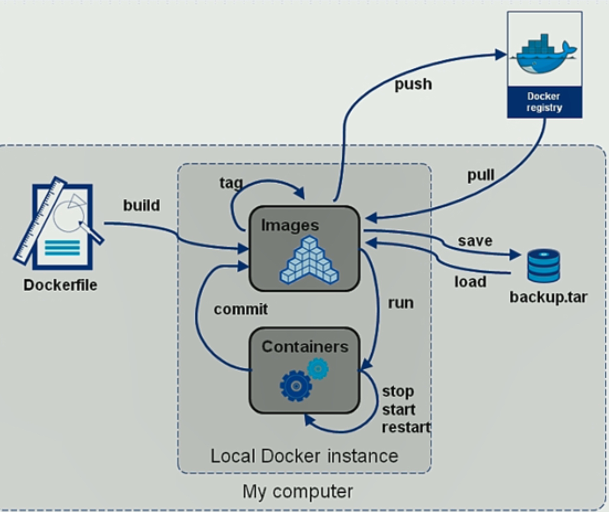


## docker网络原理

### 理解docker

清空所有环境

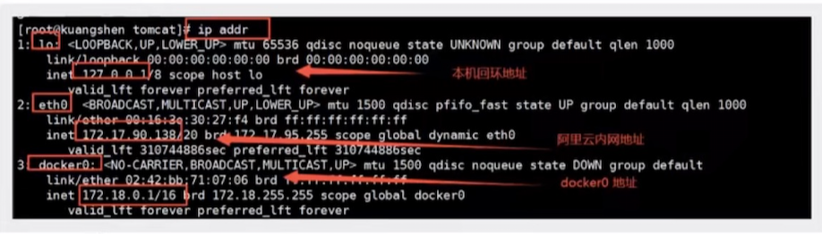

```shell
docker exec -it tomcat01 ip addr
```

**原理**

1. 我们每启动一个docker容器，docker就会给docker容器分配一个ip，我们只要安装了docker，就会有一个网卡docker()，桥接模式，使用的技术是evth-pair技术！

2. 再启动一个容器测试，发现有多了一对网卡！

    ```shell
    # 我们发现这个容器带来网卡，都是一对一对的
    # evth-pair 就是一对的虚拟设备接口，他们都是成对出现，一端连接协议，一端彼此相连
    # 正因为又这个特性，evth-pair充当一个桥梁，链接各种虚拟网络设备的
    # OpenStac，Docker容器之间的链接，OVS的链接，都是使用evth-pair技术
    ```

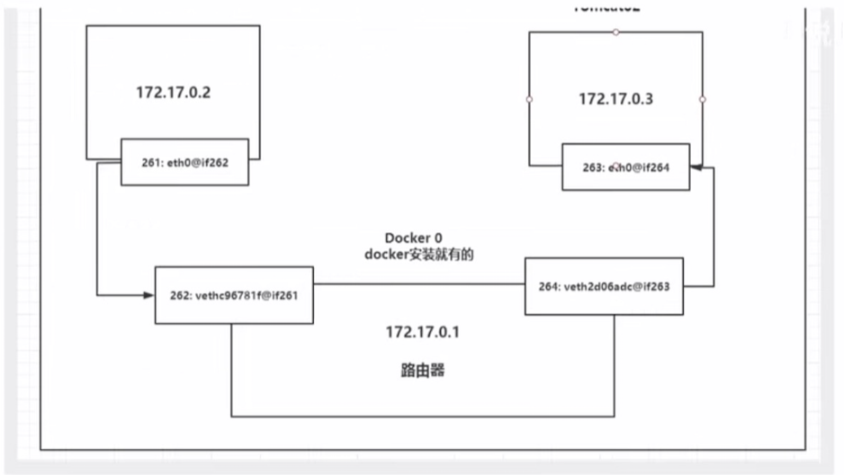

**结论**

tomcat01和tomcat02是公用的一个路由器，docker0

所有的容器不指定网络的情况下，都是docker0路由的，docker会给我们的容器分配一个默认的可用IP

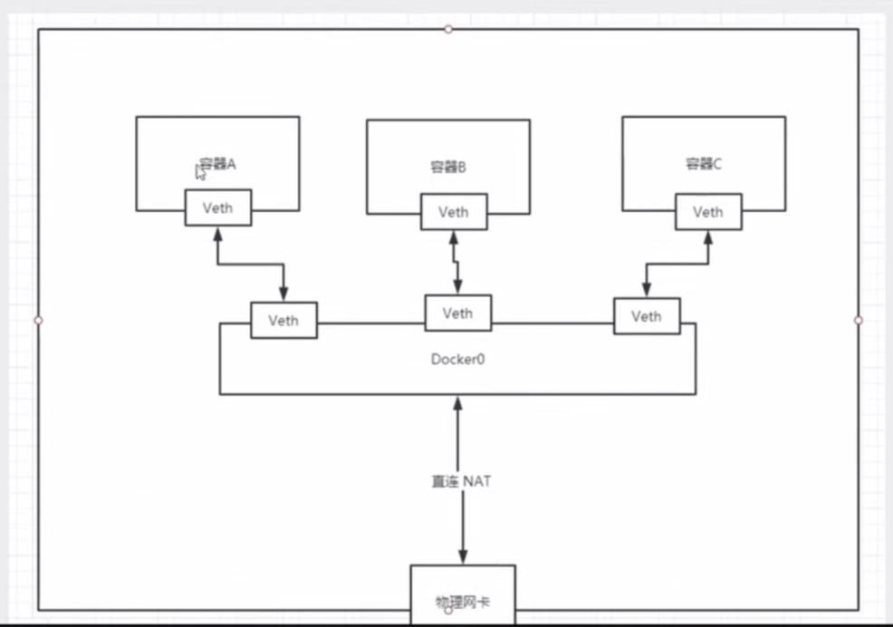

Docker 中的所有网络接口都是虚拟的。虚拟的转发效率高！（内网传递文件！）

只要容器删除，对应网桥一对没了！

### --link

```shell
# 思考一个问题，我们编写了一个微服务，database url=ip；项目不重启，数据库ip换掉了，我们希望可以处理这个问题，可以用名字惊醒访问容器？

docker exec -it tomcat02 ping tomcat01

# 如何解决呢？
# 通过--link 就可以解决了网络连通问题
docker run -d -P --name tomcat03 --link tomcat02 tomcat

# 当然反响是不可以的，需要反向链接
```

### 自定义网络

```shell
# 查看所有的docker网络
docker network ls

bridge # 桥接docker（默认，自己桥接也是使用bridge模式）
none # 不配置网络
host # 和宿主机共享网络
container # 容器网络来连通！（用的少！局限性很大）

docker run -d -P --name tomcat01 tomcat
docker run -d -P --name tomcat01 --next bridge tomcat
# docker0特点，默认域名不能访问，--link可以打通连接

# 我们可以自定义一个网络！
# docker network create --driver bridge --subnet 192.168.0.0/16 --gateway 192.168.0.1 mynet
```

### 网络连通

```shell
docker network connect 选项 network 容器
# 测试打通 tomcat01 - mynet
# 连通之后就是将 tomcat01 放到了mynet网络下
# 一个容器两个ip
```

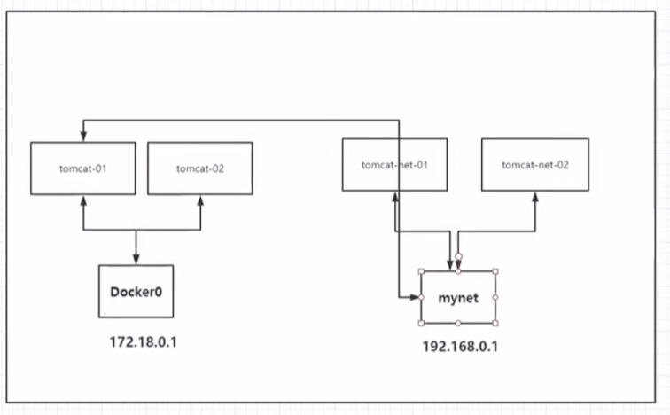

## IDEA整合docker

## docker-compose

## docker-swarm

## CI/CD-jenkins

